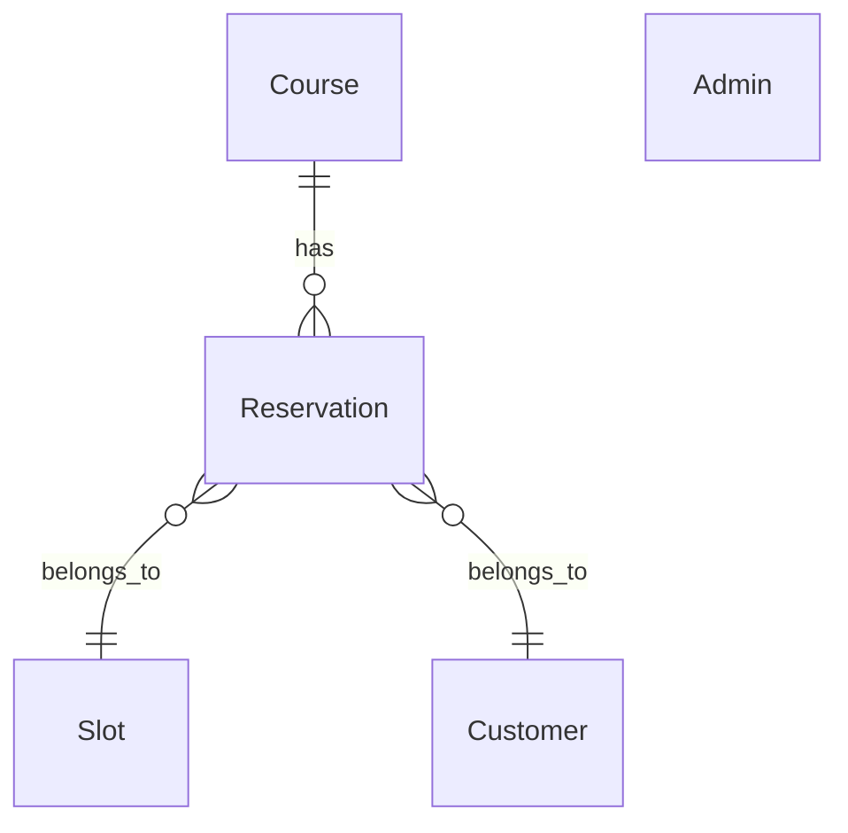

# 予約システム管理画面 - 要件定義（ブラッシュアップ版）

## 1. システム概要

本システムは オリジナル香水作り体験の予約管理を行うWebアプリケーションである。

構成は以下の2つ。

① 公開サイト（予約導線）
ユーザーが体験予約を行う

② 管理画面（バックオフィス）
店舗スタッフが予約管理を行う

## 2. システム構成
ユーザー
   ↓
Webサイト（HTML/CSS/JS）
   ↓
Spring Boot API
   ↓
Database
   ↓
管理画面（Admin UI）

## 3. ユーザー側予約フロー

既存ワイヤーフレームと一致。

コース選択
 ↓
日程選択
 ↓
人数選択
 ↓
情報入力
 ↓
確認
 ↓
予約完了

対応ページ

- course-12blend.html
- course-20blend-limited.html
- reserve-select-slot.html
- reserve-form.html
- reserve-confirm.html
- reserve-complete.html

## 4. 管理画面機能（重要）

### 管理画面トップ（ダッシュボード）

表示内容

- 今日の予約件数
- 今週の予約件数
- 人気コース
- キャンセル数

表示例

今日の予約 12件
今週の予約 64件

人気コース
1位 12種コース
2位 20種コース

### 5. 予約管理

最重要機能

#### 予約一覧

表示項目

- 予約ID
- 予約日
- 時間
- コース
- 人数
- 顧客名
- ステータス
- 操作

操作

- 詳細
- 編集
- キャンセル
- 削除

#### 予約詳細

表示

- 予約ID
- 予約日時
- コース
- 人数
- 顧客名
- メール
- 電話番号
- 備考
- ステータス

#### 予約編集

変更可能

- 日時変更
- 人数変更
- ステータス変更

## 6. 空き枠管理

これは予約システムのコア機能です。

基本スロット
- 11:00
- 13:00
- 15:00

管理画面操作
日付選択
↓
各時間の空き枠表示
↓
人数上限編集

例

2026-03-20

11:00  残り4席
13:00  残り2席
15:00  残り6席

## 7. コース管理

管理画面で変更可能にする。

- コース名
- 料金
- 説明
- 有効/無効

例

- 12種ブレンドコース
- 20種ブレンドコース

## 8. 顧客管理

最低限

- 顧客一覧
- 予約履歴

顧客テーブル

- 名前
- メール
- 電話
- 来店回数

## 9. レポート機能

運営視点で重要

- 日別予約数
- 月別予約数
- コース人気ランキング
- キャンセル率

## 10. 管理者認証

管理画面URL

/admin/login

ログイン方式

- メール
- パスワード

セキュリティ

- bcrypt
- JWT or Session
- CSRF対策

## 11. 技術スタック（修正版）

あなたの資料に合わせるとこれがベストです。

フロント
- HTML
- CSS
- JavaScript

バックエンド
- Java
- Spring Boot

理由

・プロジェクト資料と一致
・管理画面開発に強い
・DB接続が安定

テンプレート
- Thymeleaf

ORM
- MyBatis

DB

開発
- H2

本番
- MySQL

## 12. DB設計（重要）

最低限必要テーブル

### reservations
- id
- course_id
- date
- time
- people
- customer_name
- email
- phone
- status
- created_at

### courses
- id
- name
- price
- description
- active

### slots
- id
- date
- time
- capacity
- reserved

### admins
- id
- email
- password
- role

## 13. 管理画面URL設計
- /admin/login
- /admin/dashboard
- /admin/reservations
- /admin/reservations/{id}
- /admin/slots
- /admin/courses
- /admin/customers

## 14. API設計
### 予約
- POST /api/reservations
- GET /api/reservations
- GET /api/reservations/{id}
- PUT /api/reservations/{id}
- DELETE /api/reservations/{id}

### 空き枠
- GET /api/slots
- PUT /api/slots

### コース
- GET /api/courses
- PUT /api/courses

## 15. 管理画面ワイヤーフレーム

あなたのワイヤーフレーム資料に追加する必要があります。

必要画面

- ログイン
- ダッシュボード
- 予約一覧
- 予約詳細
- 空き枠管理
- コース管理
- 顧客一覧

## 16. 実装ロードマップ（重要）

これが 今後の進め方 です。

### STEP1
DB設計
- ER図作成
- テーブル定義

### STEP2
Spring Boot プロジェクト作成
- Spring Initializr
- 依存: Spring Web, Thymeleaf, MyBatis, MySQL, Spring Security

### STEP3
予約API
- 予約登録
- 予約取得

### STEP4
管理画面UI
- ログイン
- ダッシュボード
- 予約一覧

### STEP5
空き枠管理
- スロットロジック
- 予約人数計算

### STEP6
フロント接続
- 予約フォーム
- API接続

## 17. このプロジェクトの完成形
ユーザーサイト
↓
予約フォーム
↓
Spring Boot API
↓
DB保存
↓
管理画面で管理

## 18. ER図（データベース設計）

この予約システムの中心は 4テーブルです。

- Course
- Reservation
- Slot
- Admin
- Customer

### ER図イメージ

```
Course
  │
  │ 1
  │
  │ n
Reservation
  │
  │ n
  │
  │ 1
Slot

Reservation
   │
   │ n
   │
   │ 1
Customer
```

### Mermaid ER図



## 19. テーブル設計

### courses

コース情報

| フィールド | 型 | 説明 |
|------------|----|------|
| id | BIGINT AUTO_INCREMENT | 主キー |
| name | VARCHAR(255) | コース名 |
| description | TEXT | 説明 |
| price | DECIMAL(10,2) | 料金 |
| duration | INT | 所要時間（分） |
| is_active | BOOLEAN | 有効フラグ |
| created_at | TIMESTAMP | 作成日時 |

例

- 1: 12種類ブレンドコース
- 2: 20種類ブレンドコース

### slots

営業枠

| フィールド | 型 | 説明 |
|------------|----|------|
| id | BIGINT AUTO_INCREMENT | 主キー |
| date | DATE | 日付 |
| time | TIME | 時間 |
| capacity | INT | 最大人数 |
| reserved_count | INT | 現在予約人数 |
| created_at | TIMESTAMP | 作成日時 |

例

- 2026-04-10 11:00
- 2026-04-10 13:00
- 2026-04-10 15:00

capacity: 最大人数
reserved_count: 現在予約人数

### customers

顧客情報

| フィールド | 型 | 説明 |
|------------|----|------|
| id | BIGINT AUTO_INCREMENT | 主キー |
| name | VARCHAR(255) | 名前 |
| email | VARCHAR(255) | メール |
| phone | VARCHAR(20) | 電話 |
| created_at | TIMESTAMP | 作成日時 |

### reservations

予約

| フィールド | 型 | 説明 |
|------------|----|------|
| id | BIGINT AUTO_INCREMENT | 主キー |
| course_id | BIGINT | コースID（外部キー） |
| slot_id | BIGINT | スロットID（外部キー） |
| customer_id | BIGINT | 顧客ID（外部キー） |
| people | INT | 人数 |
| status | ENUM('CONFIRMED', 'CANCELLED', 'VISITED') | ステータス |
| note | TEXT | 備考 |
| created_at | TIMESTAMP | 作成日時 |

status: CONFIRMED, CANCELLED, VISITED

### admins

管理者

| フィールド | 型 | 説明 |
|------------|----|------|
| id | BIGINT AUTO_INCREMENT | 主キー |
| email | VARCHAR(255) | メール |
| password_hash | VARCHAR(255) | パスワードハッシュ |
| role | VARCHAR(50) | ロール |
| created_at | TIMESTAMP | 作成日時 |

## 20. 管理画面UI設計

必要画面はこの7つです。

- ログイン
- ダッシュボード
- 予約一覧
- 予約詳細
- 空き枠管理
- コース管理
- 顧客一覧

### 管理画面構造
```
/admin
   ├ dashboard
   ├ reservations
   ├ slots
   ├ courses
   ├ customers
   └ settings
```

### ダッシュボード

表示

- 今日の予約数
- 今週の予約数
- 今月の予約数
- 人気コース

例

今日の予約: 12件
今週: 68件

人気コース
1位: 20種コース
2位: 12種コース

### 予約一覧

テーブル

| 予約ID | 予約日 | 時間 | コース | 人数 | 顧客 | ステータス | 操作 |
|--------|--------|------|--------|------|------|----------|------|
| ... | ... | ... | ... | ... | ... | ... | 詳細 / 編集 / キャンセル |

操作: 詳細, 編集, キャンセル

### 予約詳細

表示

- 予約日時
- コース
- 人数
- 顧客名
- メール
- 電話
- 備考

### 空き枠管理

カレンダー形式

日付選択
↓
時間枠表示

例

4/10

11:00  残り4
13:00  残り2
15:00  残り6

編集: 最大人数変更, 枠追加, 枠削除

### コース管理

一覧

| コース名 | 価格 | 状態 | 操作 |
|----------|------|------|------|
| ... | ... | ... | 編集 / 非公開 / 削除 |

### 顧客管理

表示

| 顧客名 | メール | 電話 | 予約回数 |
|--------|--------|------|----------|
| ... | ... | ... | ... |

## 21. API設計

基本は REST API。

### 予約API
- **予約作成**: POST /api/reservations
  body: { courseId:1, slotId:20, name:"山田太郎", email:"test@test.com", phone:"09000000000", people:2 }
- **予約一覧**: GET /api/reservations
- **予約詳細**: GET /api/reservations/{id}
- **予約キャンセル**: PUT /api/reservations/{id}/cancel

### スロットAPI
- **空き枠取得**: GET /api/slots?date=2026-04-10

### 管理API
- **予約一覧**: GET /admin/api/reservations

## 22. 予約ロジック（重要）

### 予約時処理
1. 空き枠取得
2. capacity確認
3. reservation作成
4. reserved_count +1

### キャンセル
- reserved_count -1

## 23. フロント接続

既存HTMLをAPI化

例: reserve-form.html → POST /api/reservations

## 24. 技術スタック（確定版）
- **Frontend**: HTML, CSS, JavaScript
- **Backend**: Spring Boot
- **Template**: Thymeleaf
- **ORM**: MyBatis
- **Database**: MySQL

## 25. 開発ロードマップ

順番はこれがベストです。

① DB設計: ER図, テーブル定義
② Spring Boot作成: Spring Initializr（依存: Spring Web, Thymeleaf, MyBatis, MySQL, Spring Security）
③ API: 予約API, スロットAPI
④ 管理画面: ログイン, 予約一覧
⑤ フロント連携: HTML → API接続

作成日: 2026年3月13日
バージョン: 3.0（詳細設計追加）